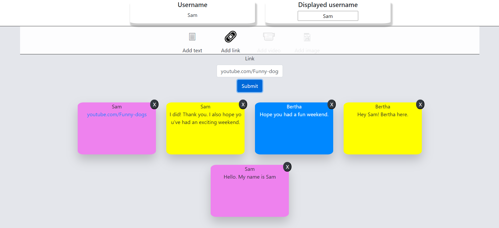

# For the IBM Hiring test - Virtual white board

# Setting up 
For getting the program up and running you need to
1. Clone project into a folder
2. Go into to newly cloned folder ~/my-virtual-whiteboard\Frontend\virtual-white-board
3. Run `npm install`. 
4. If everything worked, you should be able to run `npm start` now and see the login page of the program. 
5. Go back to the root folder and into ~/my-virtual-whiteboard/Backend
6. Open a terminal and run `python controller.py`
7. There are three created users when running the program: `user: admin, password: admin`, `user: Bertha, password: #IBMCIC`, `user: Sam`, `password: #IBMCIC`.

## Dependencies that might be needed 
For python it might be necessary to install some libraries via pip, yarn, or other. 

1. `pip install flask`
2. `pip install flask_cors`
3. `pip install utils`
---

# Justification of technology
For the frontend, I chose React, as it is the frontend technology I know. It is popular and have a strong community support. React is easy to set up with `npm` and there is just about a package for everything that can be installed if one likes to do that.

For the backend, I chose Python as it is easy and fast to get up and running. Like for React, Python has just about a library for everything. That also applies for `Flask`. `Flask` is a lightweight web application framework that I am currently also using in my Master thesis. It is easy to connect with Python and because of that same reason, Python was chosen. Python is not necessarily the best performance-wise compared to other languages, but it requires much less to get up and running. 

I considered using a mysql or postgres as a database, but I found it easier for all to run the program without and even with Pythons fast setup, I wanted to get going and chose to create a "Database"-class that could be modified to include a real database.
There is therefore no need to download any mysql, postgress or other. 

---

# Solving the case and the strategy  
## Choosing the case 
I chose the case as it seemed to have a lot of interesting aspects and very many different things to consider. I am not a frontend or full-stack expert, yet, so I also chose the case as it seemed that I would learn the most from this case.

---

## Strategy
1. Read and understand case. What is needed and what should be thought carefully through. As deadline is within a day, don't use all the time here. 
2. Setup necessary structures as fast as possible (npm & react-app, Flask, database)
3. Write just enough backend code, so I could concentrate on frontend. Especially as design always can be a real time-eater.
4. When some functionalities begin to work, test through and refactor. 
5. If more time, do more cases, but otherwise begin to write documentation in code. 
6. Make git project public.

---

## Considerations
The project was fun to do as there was many things I had not tried before. Would I do it again or refactor the code I would specially rethink and spend time understanding other ways of:
1. The login form and way of passing username password around. 
2. Creating content to the whiteboard. (Store hidden username in content for later deletions, other way of posting to the whiteboard)
3. Read into ways of storing content on whiteboard

---

## The solution:
The solution ended up having:
1. login page
2. possibility of resetting in a non-secure way
3. Three logins `user: admin, password: admin`, `user: Bertha, password: #IBMCIC`, `user: Sam`, `password: #IBMCIC` 
4. A virtual whiteboard
5. Display of username and displayed username
6. Possibility of changing displayed username
7. Possibility to add text, in form of post-its notes. 
8. Persistence of text content, i.e. you can refresh page and log in with the same or other user, and the content is there.
9. Possibility to add Links
10. Possibility to remove content from whiteboard if displayed username of the content and the logged in user is the same. (This can be hacked. Just change displayed name and you can remove everything.)

11. Backend code for making users administrators is implemented in database-class as `make_admin`
12. Backend code for creating users are implemented. `add`
13. Some styling has been added, but unicode characters needs to be changed, color themes can be better, gray boxes should be different. 

